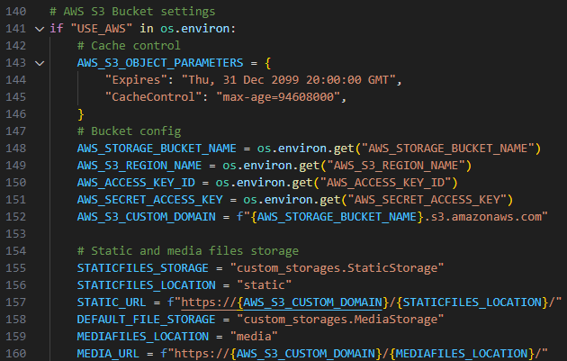
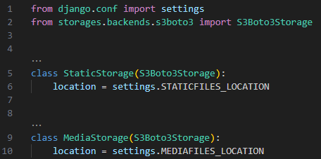
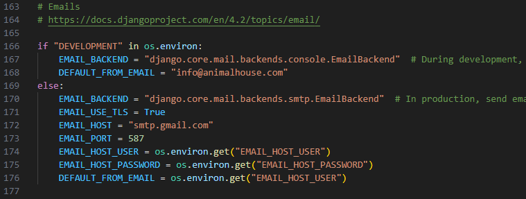

# Animal House Django version

Link to [Animal House V1](https://github.com/SJECollins/animalhouse)

## Overview

A Django version of the Animal House project linked above (originally, a RESTful Flask API with a React frontend). Users can create an account, view animals, make donations using Stripe and receive emails. Admins can add, edit, and delete animals.

## Features

### User Authentication

- Django-allauth 0.62.1
- Users can create an account, log in, log out, reset their password, and update their profile

### User Profiles

- Profiles store additional user information (address, phone number, etc.) and can be linked to donations
- Created by default with simple Django signals
- Users can update their profile information

### Animals

- Admins can add, edit, and delete animals
- Users can view animals and their details
- Animal images are stored in an AWS S3 bucket

### Donations

- Users can make donations using Stripe
- Donations can be anonymous or linked to a user profile
- Users receive an email confirmation of their donation and can view their donation history

## Implementation

### AWS S3

- Boto3 and Django-storages are used for file storage
- Setup docs:
  - [Setup Bucket](readme-docs/aws-setup-bucket.pdf)
  - [Setup IAM User](readme-docs/aws-setup-user.pdf)
- settings.py:
  - 
- custom_storages.py:
  - 

### Stripe

- Used for payment processing
- Docs: [Stripe](https://stripe.com/docs)
- Webhooks are used to handle payment events and trigger email confirmations
- Files:
  - [Donations Views](donations/views.py)
  - [Webhook](donations/webhooks.py)
  - [Webhook Handler](donations/webhook_handler.py)
  - [Stripe Elements](donations/static/donations/js/stripe_elements.js)

### Email

- Emails are sent using Django's built-in email functionality and gmail SMTP
- Docs: [Django Email](https://docs.djangoproject.com/en/4.2/topics/email/)
- Settings:
  - 
- Setup Gmail:
  - https://myaccount.google.com/apppasswords
  - Generate an app password for the project
  - Set the password without spaces as the EMAIL_HOST_PASSWORD

### Authentication

- Django-allauth is used for user authentication
- Docs: [Django-allauth installation](https://docs.allauth.org/en/latest/installation/quickstart.html)
- Styling the forms:
  - Copy allauth templates from installed location to templates folder
    - `pip show django-allauth`
    - `cp -r <location>/allauth/templates /templates/allauth`
  - Update `TEMPLATES` in settings.py to include the allauth folder
  - Update templates extends to use base.html
  - Add `` to the top elements/fields.html
  - Replace `as_p` with `|crispy` in elements/fields.html

### Form Styling

- Django-crispy-forms and crispy-bootstrap5 is used for easy form styling
- Docs:
  - [Crispy-forms](https://django-crispy-forms.readthedocs.io/en/latest/install.html)
  - [Crispy-bootstrap5](https://pypi.org/project/crispy-bootstrap5/)

### General Styling

- Bootstrap 5 is used for styling
- [Bootstrap](https://getbootstrap.com/)
